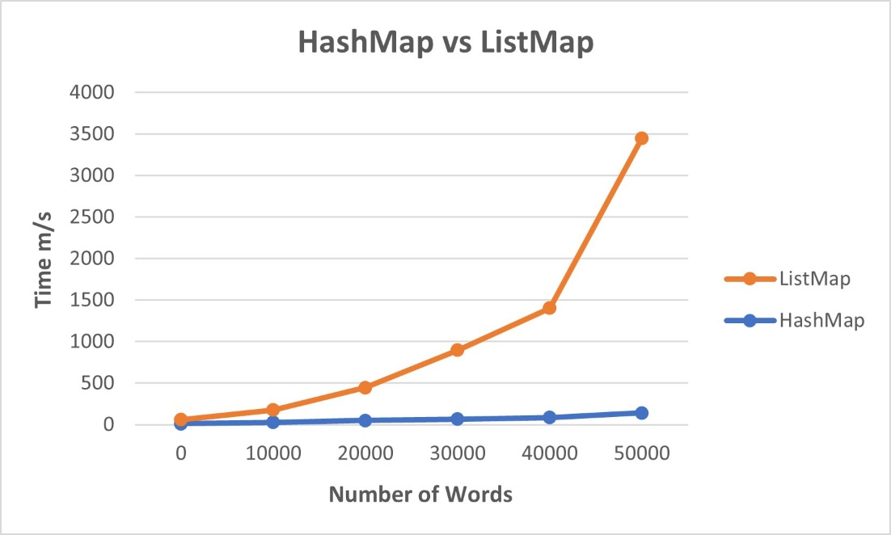

# Word Index

## System Design

### _ListWordMap_

The "ListWordMap" class implements a Linked list and the "HashWordMap" class implements a
Hash table. The interface "IWordMap" has necessary basic functions declared, which both maps
use to implement.

### _MapEntry_

The "MapEntry" class is used to create an entry object with a word and its positions. The positions
of a particular word are stored in a linked list which holds
"IPosition" values in each node. The
class has methods to access and set private variables along with adding and removing positions.

This linked list based map performs the implementation by storing an ordered collection of
elements. Each node in the linked list stores the word and its position as an entry with the help
of the "MapEntry" class provided.

### _HashWordMap_

The hash table map is initialized as an array which performs the implementation of the map in a
hash table format. Each available space in the hash table stores the word and its position as an
entry with the help of the "MapEntry" class provided. The interface "IHashMonitor" is
implemented with its declared methods used to perform necessary checks to aid the accurate
functionality of the hash map. The hash code methods are implemented using polynomial
accumulation. To perform double hashing (if the initial hash code is not valid) a new helper
function is created which performs the same operations as the first hash code method but with
a different prime number for a different hash code result. The default load factor is 0.5f, this
value provides a smaller number of collisions, since high load factors cause more collisions. The
number of probes and operations were measured to get their average, which the
"HashWordMapProvided" class uses. The map resizes after checking if the current load factor is
more than 0.5 which indicates 50% of the table being filled with words.

### _WordIndex_

The "WordIndex" has the main program which reads the files in the specified directory and the
commands from the commands text file. Switch statements are used with the possible
commands as cases to perform different operations. In search, a 2d array list is declared to store
each result as an array list entry. A linear search is performed to look for the specified word in
the map and add its number of occurrences in the file, the filename and positions (using the
iterator) in an entry array list, which is then added in the search results array list. The results array
list is sorted in most number of occurrences to the least using a comparator function. The user
specified number of results to be displayed is used to clear out extra unnecessary results from
the array. And finally, each search result of the word is outputted. The addall, add and remove
cases call on the addPos and removePos methods respectively. The overview case uses the words
iterator to look into each word in the map and get its positions using the positions iterator. The
filename of each position is added into an array list to get the number of files in the end.

---

## Run the program

### Set the target folder
WordIndex.java, which holds the main method, is where the words are read and indexed from the text files. Set the folder (from which the text files will be read) in line number N to 'TextFiles' or 'TextFiles_Shakespeare' to read from the default project data. 

### Set the commands

The commands will be read from the _commands.txt_ file. The supported commands are: addall, add, remove, search, and overview. Below is a list of explanations and example use for each command:

addall: add all the words found in the text files from the target folder

```
addall
```

add: add the words found in a specified file from the target folder

```
add lec00.txt
```

remove: remove all the words found in a specified file

```
remove lec00.txt
```

search: search the top N occurrences a word has in the added text files

```
search 3 algorithms
```

overview: print an overview of all the words indexed

```
overview
```

---

## Performance Evaluation

 
 
The time increases at a very small steady rate as the number of words inserted in the hash table based map increases. The performance and efficiency is quite high. Initially the linked list based map takes around the same amount of time as the hash map to insert words. As the number of words increases the time increases exponentially, especially when inserting the file “06kr4mnd.txt” with 48363 words. 

This proves the big Oh notation for the hash table map to insert words and checking if they exist in the map or not for insertion has worst case complexity of O(N). The worst case complexity for the linked list map is O(N2), since the increase in the number of words is drastically changing the time taken after a certain point.

